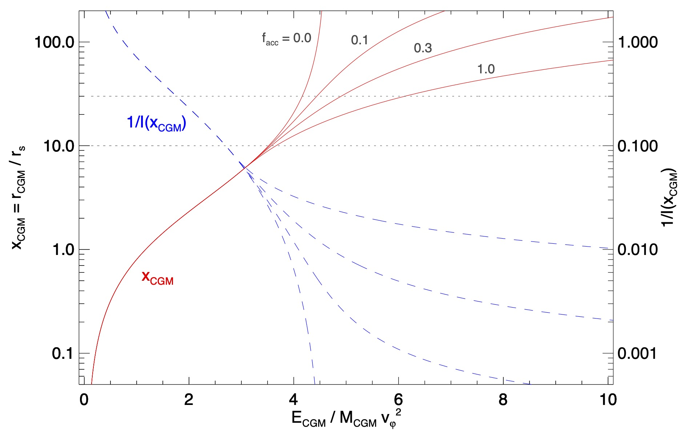

<head>

  
  
  
  
  
</head>

# Confinement
{: .no_toc}

Many models for galactic atmospheres do not include gas outside the halo's radius ($R_{\rm halo}$) and treat atmospheric gas pushed beyond $R_{\rm halo}$ as though it has become unbound. The **ExpCGM** framework is designed to rectify that shortcoming.

The page explains how **ExpCGM** models gravitational confinement of a galaxy's atmosphere. Its first section outlines the relationship between gravitational confinement and a pressure profile's shape function, using the NFW gravitational potential as an example. The next section explains why atmospheric gas pushed beyond $R_{\rm halo}$ is never completely unbound, because of the additional mass outside of $R_{\rm halo}$. The concluding section presents a model for gravitational confinement that includes the mass beyond $R_{\rm halo}$ and relates it to the halo's mass accretion rate.  That extension to the halo's potential well changes the relationships between an atmosphere's mean specific energy $\varepsilon_{\rm CGM}$, its equilibrium radius $r_{\rm CGM}$, and its pressure normalization $P_{\rm CGM}$. The changes are greatest at early times, while the halo's accretion rate is especially large.

  

    Table of contents
  

   {: .text-delta}
- TOC
{:toc}  

## Binding Energy

An atmosphere's binding energy depends on how its support energy compares with the depth of the potential well confining it. 
According to the **ExpCGM** framework, the specific support energy of a gas layer at radius $r$ is
$$\frac {3} {2} \frac {P} {f_{\rm th} \rho} =  \frac {3 f_\varphi} {2 \alpha_{\rm eff}}  v_{\rm c}^2 (r)$$
when a combination of thermal and turbulent energy supports a steady-state galactic atmosphere. (See the [Essentials](Essentials) page for an explanation and definitions of the symbols.) The specific gravitational binding energy of that gas layer is
$$\varepsilon_{\rm bind} (r) = \left( \frac {3 f_\varphi} {2 \alpha_{\rm eff}} \right) v_{\rm c}^2 (r) + \varphi(r) - \varphi_\infty$$
in which $\varphi(r)$ is the gravitational potential and $\varphi_\infty$ is its limit as $r \rightarrow \infty$. The layer $r$ is therefore bound to the potential if
$$\alpha_{\rm eff}(r) > \frac {3 f_\varphi} {2} \frac {v_{\rm c}^2(r)} {\varphi_\infty - \varphi(r)}$$
Otherwise, pressure applied by overlying atmospheric layers external to $r$ needs to confine that layer.

### An NFW Example

To see how gravity and external pressure jointly confine atmospheric gas in the **ExpCGM** framework, consider an NFW potential well 
$$\varphi_{\rm NFW} (x) = A_{\rm NFW} v_\varphi^2 \left[ 1 - \frac {\ln (1 + x)} {x} \right]$$
in which $x = r / r_{\rm s}$ expresses radius in units of the potential's scale radius $r_{\rm s}$ and $A_{\rm NFW} = 4.625$ is a normalization factor. The parameter $v_\varphi$ is then the maximum value attained by the potential's circular velocity profile 
$$v_{\rm c}^2 (x) = A_{\rm NFW} v_\varphi^2 \left[ \frac {\ln (1 + x)} {x} - \frac {1} {1 + x} \right]$$
which reaches $v_\varphi^2$ at $r = 2.163 r_{\rm s}$. Circular velocity is nearly constant with radius near that peak but gradually declines at $r \gg r_{\rm s}$. Because of that decline, the value of $\varphi_\infty$ is finite. The condition for purely gravitational confinement (with $f_\varphi = 1$) in an NFW potential well therefore reduces to
$$\alpha_{\rm eff} > \frac {3} {2} \left[ 1 - \frac {x} { (1 + x) \ln (1 + x) } \right]$$
Layers with smaller values of $\alpha_{\rm eff}$ need to be confined by overlying layers, meaning that the outermost layers of a gravitationally confined atmosphere need to have $\alpha_{\rm eff} > 3/2$.

### Critical Confinement

More generally, $\alpha_{\rm eff} = 3/2$ is a critical value for gravitational confinement of atmospheres in which the ratio of support energy density to total pressure is 3/2, for the following reasons: 

* All layers having $\alpha_{\rm eff} > 3/2$ are gravitationally bound, because each layer's specific support energy $3 v_{\rm c}^2(r) / 2 \alpha_{\rm eff} (r)$ is less than the specific energy $v_{\rm c}^2(r) = G M_r / r$ required to escape the gravitational attraction of the total mass $M_r$ within $r$. (This general result does not depend on the details of $\varphi$.)

* Gravitational confinement at small radii ($r \ll r_{\rm s}$) does not depend on $\alpha_{\rm eff}$ in potential wells with $v_{\rm c}^2 \ll \varphi_\infty$ at small radii. (This result applies to potential wells in which $v_c^2$ goes to zero as $r \rightarrow 0$, as in the NFW potential.) 

* Atmospheric layers that have $\alpha_{\rm eff} < 3/2$ can be pressure confined by the weight of overlying layers, but the pressure profile must steepen to $\alpha_{\rm eff} > 3/2$ at larger radii in order for the entire atmosphere to be gravitationally confined.

* An atmosphere with $\alpha_{\rm eff} < 3/2$ near its outer boundary needs to be confined by external pressure forces.

If the radial gradient of the thermal support fraction $f_{\rm th}$ is insignificant, then $\alpha$ replaces $\alpha_{\rm eff}$ in this bullet list. 

{: .note}
The atmospheres of galaxy clusters appear to abide by the constraints listed above, since observations of their thermal pressure profiles show that $\alpha \lesssim 1$ at $r \ll r_{\rm s}$ and $\alpha > 2$ at $r \gg r_{\rm s}$ (e.g., Pointecouteau et al. 2021, A&A, 651, A73). 

### Marginal Binding

In the **ExpCGM** framework, raising an atmosphere's mean specific energy to $\varepsilon_{\rm CGM} > \varphi_\infty$ restricts the set of pressure profiles that can be in a static equilibrium configuration. For example, the maximum value of mean specific energy in an atmosphere with $\alpha_{\rm eff} > 3/2$ cannot exceed $\varphi_\infty$, which is $4.625 v_\varphi^2$ in an NFW potential. Energy input comparable to $M_{\rm CGM} v_\varphi^2$ can exponentially expand the atmosphere, but energy input that raises $\varepsilon_{\rm CGM}$ to $\varphi_\infty$ drives the atmosphere's radius to infinity and its pressure normalization to zero. 

{: .note}
As $\varepsilon_{\rm CGM}$ approaches $\varphi_\infty$, the assumption of gravitational confinement for $\alpha_{\rm eff} > 3/2$ becomes somewhat artificial but the associated **ExpCGM** model may still be useful for quantifying the connection between an atmosphere's specific energy $\varepsilon_{\rm CGM}$ and its pressure normalization factor $P_0$.

## Evolving Potential

The previous section used an NFW profile to represent the potential well of a virialized dark matter halo and found a limiting specific energy $\varphi_\infty \approx 4.6 v_\varphi^2$ for a gravitationally bound atmosphere. However, cosmological halos evolve with time, and the specific energy required to escape an evolving halo can be substantially larger than $4.6 v_\varphi^2$.

Specifying the gravitational potential that binds the matter near the outer radius of a cosmological halo turns out to be a subtle business. Naively, the specific energy required to unbind gas at $R_{\rm halo}$ from the halo's potential well would seem to be $v_{\rm c}^2 (R_{\rm halo}) = G M_{\rm halo} / R_{\rm halo}$, but that part of the gravitational potential accounts only for the matter currently within $R_{\rm halo}$ and ignores matter at larger radii that has yet to fall into the halo. Therefore, we need to consider the halo's *entire* accretion history in order to determine the energy input required for permanent unbinding of atmospheric gas. 

### Marginally Bound Shell

In the idealized spherical collapse model (see the [Accretion](Accretion) page), there is a marginally bound shell containing a mass $M_\infty$ that asymptotically approaches a radius
$$R_\infty = \left( \frac {G M_\infty} {H_0^2 \Omega_\Lambda} \right)^{1/3}$$
as $t \rightarrow \infty$. All of the shells within the marginally bound shell's radius are gravitationally bound and ultimately collapse toward $R = 0$. Ideally, the zero point of the overall gravitational potential should result in zero binding energy for the marginally bound shell. However, both $M_\infty$ and $R_\infty$ may be far larger than $M_{\rm halo}$ and $R_{\rm halo}$, as they usually correspond to the mass and radius of the supercluster of galaxies to which the galaxy of interest belongs.

### Permanent Escape

More pragmatically, we would like know whether gas that passes outside of $R_{\rm halo}$ early in time, when $M_{\rm halo}$ is small, still belongs to a galaxy's atmosphere later on, when both $M_{\rm halo}$ and $R_{\rm halo}$ are considerably larger. To explore that possibility, we can define $M_0$ to be a halo's mass at the present time $t_0$. The radius $R_0 (t)$ of the shell containing mass $M_0$ can be computed from the equation of motion for a ballistic shell that reaches its turnaround radius at $t_{\rm ta} = t_0 / 2$. Escaping the gravitational potential of the halo's eventual mass $M_0$ is easiest at that moment and requires a specific energy $\gtrsim G M_0 / R_0 (t_{\rm ta})$. According to the spherical collapse model, the halo's radius at time $t_0$ is $R_{\rm halo} (t_0) \approx R_0 (t_0/2) / 2$. Permanent escape from the halo's potential therefore requires a specific energy exceeding
  $$\frac {G M_0} {2 R_{\rm halo}(t_0)}$$
even early in time, when the circular velocity at $R_{\rm halo} (t)$ might be considerably smaller than the value it attains later. 

For example, consider a massive galaxy that will eventually become the central galaxy of a large cluster of galaxies. Suppose that the circular velocity of that galaxy is $v_\varphi \sim 400 \, {\rm km \, s^{-1}}$ early in time, while the galaxy is still forming. Later in time that same galaxy will be centered within a galaxy cluster with a circular velocity $v_c \sim 1600 \, {\rm km \, s^{-1}}$ (corresponding to $kT_\varphi \sim 8 \, {\rm keV}$). During that galaxy's history, the circular velocity at $R_0$ reaches its minimum value $v_0 \sim 1600 \, {\rm km \, s^{-1}} / \sqrt{2}$ at the turnaround time $t_0 / 2$ of the shell containing the cluster's current mass $M_0$. Consequently, $v_0^2 \gtrsim 8 v_\varphi^2$ while the cluster's central galaxy is forming. The energy input required to unbind the central galaxy's atmosphere from the halo's eventual potential well is therefore an order of magnitude greater than what one would infer from a virialized halo's potential at early times.

## Extended Potential

To account for atmospheric confinement by matter extending beyond the halo, the **ExpCGM** framework includes an extended potential well that is unbounded. Numerical simulations of cosmological structure formation indicate that the total mass density $\rho_M$ at radii several times $R_{\rm halo}$ declines with an approximate power-law dependence on radius ranging from $r^{-1}$ to $r^{-1.5}$ (e.g., see Diemer & Kravtsov 2014, ApJ, 789, 1). Users of the **ExpCGM** framework may therefore opt to account for the gravitational potential of matter external to the halo using the extended potential
$$\varphi_{\rm ext} (r) = 2 \pi G \rho_{\rm ext} R_{\rm halo}^2 \left( \frac {r} {R_{\rm halo}} - 1 \right) \left( 1 - \frac {R_{\rm halo}} {r} \right) $$
that results from assuming $\rho_M (r) = \rho_{\rm ext} (r/R_{\rm halo})^{-1}$ outside of $R_{\rm halo}$.

### Halo Accretion Parameter

The extended potential's density normalization factor $\rho_{\rm ext}$ is linked to the halo's mass accretion rate. Assuming that $\rho_{\rm ext}$ corresponds to matter that is currently accreting onto the halo gives $\rho_{\rm ext} = \dot{M}\_{\rm halo} / 4 \pi R_{\rm halo}^2 v_{\rm acc}$ and

  $$\varphi_{\rm ext} (r) = \frac {G \dot{M}_{\rm halo}} {v_{\rm acc}} \left( \frac {r} {R_{\rm halo}} - 1 \right) \left( 1 - \frac {R_{\rm halo}} {r} \right)$$

in which $v_{\rm acc}$ is the infall speed of accreting matter. 

Notice that the leading factor on the right of the equation breaks up into two factors that are easier to interpret:

  $$\frac {G \dot{M}_{\rm halo}} {v_{\rm acc}} = \left( \frac {G M_{\rm halo}} {R_{\rm halo}} \right) \left( \frac {R_{\rm halo}} {v_{\rm acc}} \frac {\dot{M}_{\rm halo}} {M_{\rm halo}} \right)$$

The first factor in parentheses is the specific energy required to escape from the radius $R_{\rm halo}$ encompassing a mass $M_{\rm halo}$. The second one is the fraction $f_{\rm acc}$ of a halo's mass that accretes on a timescale $R_{\rm halo} / v_{\rm acc}$. 

In the **ExpCGM** framework, $f_{\rm acc} \equiv (R_{\rm halo}/v_{\rm acc}) \dot{M}\_{\rm halo} / M_{\rm halo}$ is a ***halo accretion parameter*** that specifies the normalization of the extended potential as follows:
  $$\varphi_{\rm ext} (r) = f_{\rm acc} \left( \frac {G M_{\rm halo}} {R_{\rm halo}} \right) \left( \frac {r} {R_{\rm halo}} - 1 \right) \left( 1 - \frac {R_{\rm halo}} {r} \right)$$ 
It can be estimated using the approximation $v_{\rm acc} \approx (G M_{\rm halo} / 2 R_{\rm halo} )^{1/2}$ that comes from spherical collapse, giving

  $$f_{\rm acc} \approx 2 \left( \frac {\rho_{\rm cr}} {\rho_{\rm halo}} \right)^{1/2} \frac {\dot{M}_{\rm halo}} {H M_{\rm halo}}$$

where is $H$ is the Hubble expansion parameter, $\rho_{\rm halo}$ is the halo's mass density, and $\rho_{\rm cr} = 3 H^2 / 8 \pi G$ is the universe's critical density. Early in cosmic time, while halos are rapidly forming, $f_{\rm acc}$ can be of order unity. However, it becomes closer to $f_{\rm acc} \sim 0.1$ later in time, as structure formation slows down.

### Enhanced Confinement

The figure below illustrates how the relationship between an atmosphere's equilibrium radius $r_{\rm CGM}$ and its specific energy $\varepsilon_{\rm CGM}$ depends on $f_{\rm acc}$. It starts with an NFW potential well and assumes that thermal pressure follows $P(r) \propto r^{-3/2}$, as in the figure on the [Essentials](Essentials) page. Then it adds the extended potential $\varphi_{\rm ext}(r)$ using several values of the normalization parameter $f_{\rm acc}$, as labeled. The lines for $f_{\rm acc} = 0$ are the same as in the original figure, but they shift to the right as $f_{\rm acc}$ increases. An increase in $f_{\rm acc}$ corresponds to an an enhancement of the potential well's ability to confine gas that has been pushed beyond $R_{\rm halo}$. Consequently, equilibrium solutions are possible for larger values of $\varepsilon_{\rm CGM}$ than in the NFW-only case.

<figure>
    
</figure>

Dashed lines show how the pressure profile normalization $P_0 \propto 1 / I(x_{\rm CGM})$ at $r_0$ declines as $E_{\rm CGM}$ increases.  Horizontal dotted lines show the chosen halo radius ($R_{\rm halo} = 10 r_{\rm s}$) and the approximate stagnation radius ($3 R_{\rm halo} = 30 r_{\rm s}$) beyond which universal expansion is carrying matter away from the halo.

The extended potential in **ExpCGM** is formally unbounded, with $\varphi_{\rm ext} \rightarrow \infty$ as $r \rightarrow \infty$. Any atmosphere contained within it is therefore gravitationally confined, regardless of its specific energy. However, even an atmosphere that is formally bound becomes extremely diffuse for $\varepsilon_{\rm CGM} \gg G M_{\rm halo} / R_{\rm halo} \sim v_\varphi^2$. 

{: .note}
An **ExpCGM** model atmosphere inevitably becomes unrealistic beyond $r \sim 3 R_{\rm halo}$ because the dynamical time there starts to exceed the universe's age, meaning that the force-balance assumption the model is based on becomes unphysical. Mass shells near $r \sim 3 R_{\rm halo}$ have reached their maximum radii and are just starting to fall back toward the halo. Atmospheric gas pushed beyond $r \sim 3 R_{\rm halo}$ is therefore entering a region where the atmosphere needs to be modeled in a context that accounts for its expansion speed. The factor of 3 can be derived from Kepler's Third Law, which gives $R_{\rm ta}(t) = 2^{2/3} R_{\rm ta}(t/2) \approx 2^{5/3} R_{\rm halo}(t) \approx 3 R_{\rm halo} (t)$ for the turnaround radius $R_{\rm ta}$ in a spherical collapse model without dark energy.    
