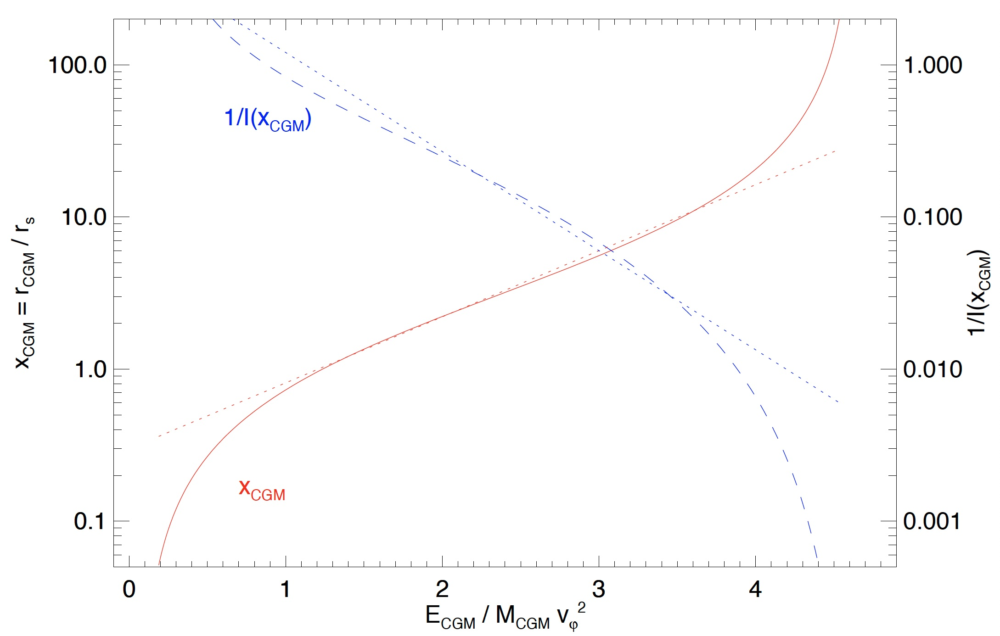

<head>
  <title>MathJax tests</title>
  
  
  
  
  
  
</head>

# Essentials
{: .no_toc}

This page introduces the essential elements of the most basic building block of **ExpCGM**: a steady-state galactic atmosphere model. It explains how **ExpCGM** applies the principles of force balance and atmospheric specific energy, then provides a simple example illustrating how an **ExpCGM** model atmosphere emerges from those principles. Descriptions of how **ExpCGM** accounts for turbulent support and thermalization of atmospheric energy follow the example. A concluding section outlines how the characteristics of steady-state atmosphere models inform **ExpCGM** models for atmospheric evolution.

  

    Contents
  

   {: .text-delta}
- TOC
{:toc}  

## Force Balance 

An efficient method for determining the steady-state properties of a galactic atmosphere lies at the heart of **ExpCGM**. Each model atmosphere has a total gas mass $M_{\rm CGM}$ and a total energy $E_{\rm CGM}$, and the model applies a force-balance condition to determine how the atmosphere's equilbrium radius $r_{\rm CGM}$ depends on $M_{\rm CGM}$ and $E_{\rm CGM}$. 

### Hydrostatic Equilibrium

The most basic example of a force-balanced atmospheric configuration is hydrostatic equilibrium, described by 
  $$\frac {dP} {dr} = -  \rho \frac {d \varphi} {dr}$$ 
where $P$ is thermal pressure, $\rho$ is gas density, and $\varphi$ is a spherically symmetric gravitational potential.

### Pressure Shape Function

Direct integration of the hydrostatic equilbrium equation is possible if both the pressure profile's ***shape function***
  $$\alpha (r) \equiv - \frac {d \ln P} {d \ln r}$$
and the gravitational potential are known functions of radius. Integrating the shape function leads to a dimensionless pressure profile normalized to unity at a reference radius $r_0$:
  $$f_P(r) \equiv \exp \left[ - \int_1^{r/r_0} \frac {\alpha (x)} {x}  d x \right]$$ 
Providing a pressure normalization $P_0$ at $r_0$ then specifies the atmosphere's equilibrium pressure profile:
  $$P(r) = P_0 f_P(r)$$

{: .note}
Many details of an **ExpCGM** atmosphere model hinge on a user's choice for the shape function $\alpha(r)$. That choice represents an assumption about the physical processes responsible for maintaining the pressure profile. See the [Pressure Profiles](PressureProfiles) page for more detail.

### Temperature Profile

A spherical atmosphere supported by thermal pressure in hydrostatic equilibrium has the temperature profile
  $$T(r) = \frac {2 T_\varphi (r) } {\alpha (r)}$$
The function $T_\varphi (r) \equiv \mu m_p v_{\rm c}^2(r) / 2k$ represents a ***gravitational temperature profile***. It comes from solving the hydrostatic equilibrium equation while assuming $P \propto r^{-2}$, a mean mass per atmospheric particle $\mu m_p$, and a gravitational potential with a circular velocity profile $v_{\rm c} (r) = ( r \cdot d \varphi / dr)^{1/2}$. It is normalized so that $T(r) = T_\varphi (r)$ for a hydrostatic atmosphere with $P \propto r^{-2}$ in an isothermal potential well that has constant $v_{\rm c}$. In that special case, both the atmospheric temperature and the ratio of gas density to total mass density remain constant.

{: .note}
The astronomical literature often calls something like $T_\varphi$ a *virial temperature*. However, a galactic atmosphere can have $T \neq T_\varphi$ without violating the virial theorem, because the virial theorem applies to an *entire* self-gravitating system, not just the gaseous component on its own. Also, a self-gravitating atmosphere with $T \ll T_\varphi$ can satisfy the virial theorem on its own as long as its total kinetic energy provides enough support to balance gravity. That is why **ExpCGM** calls $T_\varphi$ a *gravitational temperature*, not a virial temperature.

### Density Profile

Given those pressure and temperature profiles, the gas density profile of an equilibrium **ExpCGM** atmosphere model becomes
  $$\rho (r) = P_0 \frac {\alpha (r) f_P (r)} {v_{\rm c}^2(r)}$$
For example, the gas mass density at the reference radius $r_0$ is simply $\rho_0 = P_0 / (v_c^2 / 2)$ in an equilibrium atmosphere with $\alpha = 2$.

### Generalized Force Balance

To represent equilibrium atmospheres partially supported by non-thermal energy, the **ExpCGM** framework generalizes hydrostatic equilibrium using the force balance equation
  $$\frac {d} {dr} \frac {P} {f_{\rm th}} = - \rho f_\varphi  \frac {d \varphi} {dr}$$
The ***thermalization fraction*** $f_{\rm th}$ represents the fractional contribution of thermal pressure to the total support opposing gravity. The ***force modification factor*** $f_\varphi$ accounts for phenomena (such as rotation) that alter the effective gravitational force pulling the atmosphere inward. 

With those generalizations, an **ExpCGM** atmosphere's equilibrium temperature and density profiles become 
  $$T(r) = \frac {2 f_{\rm th} f_\varphi} {\alpha_{\rm eff} (r)} ~T_\varphi (r)~~~~~~,~~~~~~\rho (r) = P_0 \frac {\alpha_{\rm eff} (r) f_P (r)}{f_{\rm th} f_\varphi v_{\rm c}^2(r)}$$ 
Here, the function 
  $$\alpha_{\rm eff} (r) \equiv \alpha(r) + \frac {d \ln f_{\rm th}} {d \ln r}$$ 
is a ***generalized shape function*** for atmospheric support, to be used if $f_{\rm th}$ depends on radius. It is also possible for $f_\varphi$ to depend on radius.

{: .note}
Other formulations of atmospheric force balance sometimes express resistance to gravity in terms of a total pressure $P_{\rm tot} = P / f_{\rm th}$. However, **ExpCGM** explicitly accounts for the thermal pressure contribution using the $f_{\rm th}$ factor so that an equilibrium atmosphere's temperature profile can be directly inferred from just force balance considerations and the thermalization fraction $f_{\rm th}$.

## Specific Energy

A galactic atmosphere of total mass $M_{\rm CGM}$ expands if its total energy $E_{\rm CGM}$ increases, and it contracts if its total energy declines. A galactic atmosphere's equilibrium radius $r_{\rm CGM}$ therefore depends on its ***mean specific energy***
  $$\varepsilon_{\rm CGM} = \frac {E_{\rm CGM}} {M_{\rm CGM}}$$
Several integrals are needed to determine how $\varepsilon_{\rm CGM}$ depends on $r_{\rm CGM}$ in a force-balanced **ExpCGM** atmosphere. Inverting that relationship then gives the dependence of $r_{\rm CGM}$ on $\varepsilon_{\rm CGM}$.

### Gas Mass

Integrating the gas mass density $\rho(r)$ of an atmosphere in a potential well with maximum circular velocity $v_\varphi \equiv \max (v_{\rm c})$ gives its gas mass profile
  $$M_{\rm CGM} (r) = \frac {4 \pi r_0^3 P_0} {v_\varphi^2} I \left( \frac {r} {r_0} \right) ~~~~~~,~~~~~~I (x) \equiv v_\varphi^2 \int_0^{r/r_0} \frac {\alpha_{\rm eff} (x) f_P (x)} { f_{\rm th} f_\varphi v_{\rm c}^2 (x) } x^2 dx$$

### Gravitational Energy

Integrating $\varphi (r) \rho (r)$ gives the atmosphere's cumulative gravitational energy profile
  $$E_\varphi (r) = 4 \pi r_0^3 P_0 J_\varphi \left( \frac {r} {r_0} \right) ~~~~~~,~~~~~~J_\varphi (x) \equiv \int_0^{r/r_0} \frac {\alpha_{\rm eff} (x) f_P (x) \varphi(x)} { f_{\rm th} f_\varphi v_{\rm c}^2 (x) }  x^2 dx $$

### Thermal Energy 

Integrating $3 P(r)/2$ gives its cumulative thermal energy profile
  $$E_{\rm th} (r) = 4 \pi r_0^3 P_0  J_{\rm th} \left( \frac {r} {r_0} \right) ~~~~~~,~~~~~~J_{\rm th} (x) \equiv \frac {3} {2} \int_0^x f_P (x) x^2 dx$$

### Non-Thermal Energy

If there are non-thermal pressure components, the cumulative non-thermal support energy profile is
  $$E_{\rm nt} (r) = 4 \pi r_0^3 P_0 J_{\rm nt} \left( \frac {r} {r_0} \right) ~~~~~~,~~~~~~J_{\rm nt} (x) \equiv \int_0^x \frac {(1 - f_{\rm th}) f_P (x)} {f_{\rm th} (\gamma_{\rm nt} - 1)} x^2  dx$$
The factor $\gamma_{\rm nt} - 1$ in the integral's denominator is the local ratio of non-thermal pressure support to non-thermal energy density, which can be different from 2/3. 

### Total Specific Energy

To obtain a galactic atmosphere's total specific energy, the **ExpCGM** framework adds up the energy integrals to make the function 
  $$F(x) = \frac { J_\varphi (x) + J_{\rm th}(x) + J_{\rm nt}(x)} {I(x)}$$
It is defined so that
  $$\varepsilon_{\rm CGM} = v_\varphi^2 F \left( \frac {r_{\rm CGM}} {r_0} \right)$$
relates an atmosphere's mean specific energy $\varepsilon_{\rm CGM}$ to its equilibrium radius $r_{\rm CGM}$. 

### Equilibrium Radius

Inverting $F(x)$ then gives the atmosphere's equilibrium radius $r_{\rm CGM} = x_{\rm CGM} r_0$ as a function of $\varepsilon_{\rm CGM} / v_\varphi^2$:
  $$r_{\rm CGM} = r_0 F^{-1} \left( \frac {\varepsilon_{\rm CGM}} {v_\varphi^2} \right)$$

### Pressure Normalization

Once an **ExpCGM** atmosphere's equilibrium radius has been determined, the relation
  $$P_0 = \frac {M_{\rm CGM} v_\varphi^2} {4 \pi r_0^3} \frac {1} {I(r_{\rm CGM}/r_0)}$$
gives the pressure profile's normalization at $r_0$.

{:.note}
These relationships between $\varepsilon_{\rm CGM}$, $r_{\rm CGM}$, and $P_0$ are the cornerstones of ***all*** **ExpCGM** atmosphere models. They depend primarily on a user's choices for $\varphi(r)$ and $\alpha(r)$ and determine how the resulting atmosphere expands or contracts as its total mass and energy change. They may also depend on a user's choices for $f_{\rm th}(r)$ and $f_\varphi(r)$.

## A Simple Example 

The following example illustrates how solutions for steady-state atmospheric structure emerge from the **ExpCGM** framework. 

### Power-Law Pressure Profile

First, assume that the atmosphere has a power-law pressure profile (constant $\alpha$), that the atmosphere's support energy is purely thermal ($f_{\rm th} =1$), and that there are no radial forces other than gravity ($f_\varphi =1$). In that case, an **ExpCGM** atmosphere's equilibrium pressure, temperature, and density profiles become
  $$P(r) = P_0 \left( \frac {r} {r_0} \right)^{-\alpha}~~~~,~~~~T(r) = \frac {2 T_\varphi (r)} {\alpha} ~~~~,~~~~\rho (r) = \frac {\alpha P_0} {v_{\rm c}^2(r)} \left( \frac {r} {r_0} \right)^{-\alpha}$$

### NFW Potential Well

Next, consider confinement by an Navarro-Frenk-White (NFW) gravitational potential with a zero point at $r=0$. We can express that potential as
  $$\varphi_{\rm NFW} (x) = A_{\rm NFW} v_\varphi^2 \left[ 1 - \frac {\ln (1 + x)} {x} \right]$$
in which $x = r / r_{\rm s}$ represents how $r$ compares with the potential's ***scale radius*** $r_{\rm s}$. Choosing $A_{\rm NFW} = 4.625$ makes the parameter $v_\varphi^2$ equal to the maximum value of the NFW circular velocity profile
  $$v_{\rm c}^2 (x) = A_{\rm NFW} v_\varphi^2 \left[ \frac {\ln (1 + x)} {x}  - \frac {1} {1 + x} \right]$$
For convenience, we will choose $r_0$ to be identical to $r_{\rm s}$ in this example, so that $P_0$ is the thermal pressure at $r_{\rm s}$.

### Energy and Mass Integrals

With those choices, the integrals needed for determining the atmosphere's equilibrium radius become much simpler. The integral giving the dimensionless gas mass profile simplifies to 
  $$I(x) = \frac {\alpha} {A_{\rm NFW}} \int_0^x \left[ \frac {x} {\ln (1+x) - x / (1 + x) } \right] x^{2 - \alpha} dx$$
The integral giving the cumulative gravitational energy profile simplifies to         
  $$J_\varphi(x) = \alpha \int_0^x \left[ \frac {x - \ln (1 + x)} {\ln (1+x) - x / (1 + x)} \right] x^{2 - \alpha} dx$$
The cumulative thermal energy profile becomes an algebraic function: 
  $$J_{\rm th}(x) = \frac {3 x^{3-\alpha}} {6 - 2\alpha}$$
All of the support energy is thermal, and so there is no need to compute $J_{\rm nt} (x)$.

### Energy and Expansion

The figure below shows the relationship between atmospheric radius and specific energy that follows from these integrals. A solid red line represents how an atmosphere's equilibrium radius $r_{\rm CGM} = x_{\rm CGM} r_{\rm s}$ depends on its mean specific energy $\varepsilon_{\rm CGM} = E_{\rm CGM} / M_{\rm CGM}$ for a case with $\alpha = 3/2$. The equilibrium radius starts at zero for $\varepsilon_{\rm CGM} = 0$ and rises through $r_{\rm CGM} \approx 6 r_{\rm s}$ at $\varepsilon_{\rm CGM} \approx 3 v_\varphi^2$. The atmosphere's radius then formally approaches infinity as $\varepsilon_{\rm CGM}$ approaches $A_{\rm NFW} v_\varphi^2$ because atmospheric gas with specific energy exceeding $A_{\rm NFW} v_\varphi^2$ is unbound. A dashed blue line shows how the normalization $P_0 \propto 1/ I(x_{\rm CGM})$ of the atmosphere's pressure profile declines as $\varepsilon_{\rm CGM}$ rises and the atmosphere expands.

<figure>
    
</figure>

Dotted lines in the figure illustrate relationships that are exponentially sensitive to the scaled specific energy $\varepsilon_{\rm CGM} / v_\varphi^2$. They are similar to the solid and dashed lines within the range $v_\varphi^2 \lesssim \varepsilon_{\rm CGM} \lesssim 4 v_\varphi^2$. However, the functions describing the atmosphere's equilibrium radius and pressure normalization become even more sensitive than the exponential relationships as $\varepsilon_{\rm CGM}$ surpasses $4 v_\varphi^2$. Consequently, feedback mechanisms capable of further raising the atmosphere's specific energy drastically lower its density and radiative cooling rate.

{:.note}
The relationship between $r_{\rm CGM}$ and $\varepsilon_{\rm CGM}$ would be purely exponential for an atmosphere with constant $\alpha$ in a gravitational potential with constant $v_{\rm c}$. The relationships in the figure are consequently *nearly* exponential in the portion of an NFW potential well in which $v_{\rm c}$ is *nearly* constant. 

## Turbulent Support 

The **ExpCGM** framework was intentionally designed to model galactic atmospheres supported by a combination of thermal energy and non-thermal gas motions that are usually called "turbulence" even though they do not necessarily arise from a classic Kolmogorov cascade of eddies. For simplicity, **ExpCGM** treats those gas motions as isotropic, with a one-dimensional velocity dispersion $\sigma_{\rm 1D}$, so that the thermalization fraction is
  $$f_{\rm th} = \frac {P} {P + \rho \sigma_{\rm 1D}^2}$$
Conveniently, the ratio of turbulent energy density to turbulent pressure support is the same as the thermal ratio, corresponding to $\gamma_{\rm nt} = 5/3$. Summing the cumulative thermal and turbulent energy profiles gives
  $$4 \pi r_0^3 P_0 \left[ J_{\rm th} (x) + J_{\rm nt} (x) \right] =  4 \pi r_0^3 \int_0^x \frac {3} {2} \frac {P (x)} {f_{\rm th}(x)} x^2 dx$$
The equilibrium radius of an atmosphere jointly supported by thermal and turbulent energy therefore depends only on the total density of support energy ($3P/2 f_{\rm th}$) not the separate proportions of thermal and turbulent energy. That is because the equilibrium density profile
  $$\rho (r) = \frac {P_0 f_P (r)} {f_{\rm th}(r)} \frac {\alpha_{\rm eff}(r)} {v_{\rm c}^2 (r)}$$
is identical to the density profile of a purely hydrostatic atmosphere with $\alpha (r) = \alpha_{\rm eff} (r)$ and $f_{\rm th} = 1$.

## Thermalization 

The previous section showed why dissipation of turbulent support energy does not change the equilibrium radius or density profile of a galactic atmosphere. Turbulent dissipation simply increases $f_{\rm th}$ without altering an force-balanced atmosphere's overall structure. **ExpCGM** therefore tracks thermalization of turbulence as dissipation proceeds using a differential equation for $f_{\rm th}$ that applies to a force-balanced atmosphere jointly supported by turbulence and thermal energy. 

### Energy Injection

User-specified models provide the total rate of non-gravitational energy injection $\dot{E}\_{\rm inj}$ from cosmological accretion and galactic feedback. That energy input branches into a user-specified fraction $f_{\rm inj,th}$ going directly into heat and a complementary fraction $1 - f_{\rm inj,th}$ initially going into turbulence. Those proportions can depend on the relative contributions of cosmological accretion and feedback to $\dot{E}\_{\rm inj}$. 

### Dissipation Timescale

Turbulence dissipates into heat on a timescale $t_{\rm diss} = \lambda_{\rm d} / \sigma_{\rm 1D}$, in which $\lambda_{\rm d}$ is a length scale characterizing the driving of turbulence. An **ExpCGM** user can specify the value of $\lambda_{\rm d}$ relating $\sigma_{\rm 1D}$ to $t_{\rm diss}$.

### Evolution of Thermalization

Energy injection, dissipation, and radiative cooling all affect the fraction $f_{\rm th}$ of support energy in thermal form. 

* Energy injection changes the atmosphere's total amount of support energy $E_{\rm th} / f_{\rm th}$ on the timescale $t_{\rm inj} \equiv E_{\rm th} / f_{\rm th} \dot{E}\_{\rm inj}$.
  
* Dissipation converts turbulence into thermal energy at the rate $\dot{E}\_{\rm diss} = (1 - f_{\rm th}) E_{\rm th} / f_{\rm th} t_{\rm diss}$.
  
* Radiative cooling happens on a timescale $t_{\rm cool} \equiv E_{\rm th} / \dot{E}\_{\rm rad}$, where $\dot{E}\_{\rm rad}$ is a radiative loss rate computed from the atmosphere model. 

The rate of change in $f_{\rm th}$ in **ExpCGM** is derived from the overall rate of change in total atmospheric support energy

  $$\frac {d} {dt} \frac {E_{\rm th}} {f_{\rm th}} = \dot{E}_{\rm inj} - \dot{E}_{\rm rad} - \dot{E}_{\varphi,{\rm exp}}$$

and the rate of change in thermal support energy 

  $$\dot{E}_{\rm th} = \dot{E}_{\rm diss} - \dot{E}_{\rm rad} - f_{\rm th} \dot{E}_{\varphi,{\rm exp}} + f_{\rm inj,th} \dot{E}_{\rm inj}$$

In both of these equations, $\dot{E}\_{\varphi,{\rm exp}}$ is the conversion rate of atmospheric support energy into gravitational energy. The value of $\dot{E}\_{\varphi,{\rm exp}}$ is positive in an expanding atmosphere and negative in a contracting atmosphere.

The equation for $\dot{E}\_{\rm th}$ assumes that expansion and contraction are slow enough to have no effect on $f_{\rm th}$. This assumption is based on both thermal energy and turbulent energy having the same ratio of energy density to pressure, which gives them the same polytropic equation of state. However, an expanding or contracting atmosphere that is settling into an equilibrium state in a fully hydrodynamical model may be converting the kinetic energy of bulk flow into a combination of turbulent and thermal energy with a ratio different from $(1 - f_{\rm th}) / f_{\rm th}$. In principle, **ExpCGM** users can account for such differences through adjustments to the branching ratio $f_{\rm inj,th}$ for thermal energy injection.

Combining the **ExpCGM** equations for the rates of change in $E_{\rm th} / f_{\rm th}$ and $E_{\rm th}$ leads to

  $$\frac {E_{\rm th}} {f_{\rm th}} \frac {d f_{\rm th}} {dt} = \dot{E}_{\rm diss} - \left( 1 - f_{\rm th} \right) \dot{E}_{\rm rad} + \left( f_{\rm inj,th} - f_{\rm th} \right) \dot{E}_{\rm inj}$$

The time derivative of $f_{\rm th}$ can therefore be expressed as

  $$\frac {d f_{\rm th}} {dt} = \frac {1 - f_{\rm th}} {t_{\rm diss}} - \frac {(1 - f_{\rm th}) f_{\rm th}} {t_{\rm cool}} + \frac {(f_{\rm inj,th} - f_{\rm th})} {t_{\rm inj}}$$

which explicitly connects changes in $f_{\rm th}$ to the three timescales for energy exchange.

{: .important}
This equation for how thermalization changes with time does not depend on the volume of gas being considered. It can be applied to a global value of $f_{\rm th}$ characterizing the entire atmosphere. It can also be applied to individual subsets of the atmosphere with differing values of $t_{\rm diss}$, $t_{\rm cool}$, $t_{\rm inj}$, and $f_{\rm inj,th}$. 

## Atmospheric Evolution 

Evolution of a galactic atmosphere in the **ExpCGM** framework proceeds through a series of force-balanced states. They are the states the atmosphere would settle into on a dynamical timescale ($\sim r / v_c$) in the absence of heating or cooling. A series of those states is therefore a valid approximation for atmospheric evolution as long as the timescales for energy injection ($t_{\rm inj}$) and radiative cooling ($t_{\rm cool}$) are not short compared to the atmosphere's dynamical time at the radii of interest. A shorter dissipation timescale ($t_{\rm diss}$) simply ensures that $f_{\rm th}$ remains close to unity.

An **ExpCGM** atmosphere model provides the following information useful for computing $t_{\rm inj}$ and $t_{\rm cool}$.

### Radiative Cooling 

A galactic atmosphere loses thermal energy through two-body collisions that produce photons. The cooling rate per unit volume is therefore proportional to $\rho^2$ and a temperature-dependent cooling function $\Lambda_\rho (T)$ that accounts for the atmosphere's ionization state, the speeds of colliding particles, and the cross-sections for excitation of photon emission. At radius $r$, the atmosphere loses thermal energy on a timescale
  $$t_{\rm cool} = \frac {3 k T} {2 \rho \Lambda_\rho (T)}$$ 
computable using an **ExpCGM** model that gives $T(r)$ and $\rho(r)$ as functions of $\varepsilon_{\rm CGM}$ and $M_{\rm CGM}$. The [Cooling](Cooling) page provides more detail.

{: .note}
For notational compactness, the **ExpCGM** documentation sometimes uses the cooling function $\Lambda_\rho (T)$ instead of the usual cooling function $\Lambda (T)$ defined with respect to electron density $n_e$ and ion density $n_i$. They are related to each other through $\Lambda_\rho = (\mu m_p n_e n_i / \rho^2) \Lambda$.  

### Galactic Feedback

A galactic atmosphere gains support energy when it incorporates feedback energy released from the central galaxy. The time-averaged rate of energy input depends on how rapidly a galaxy's atmosphere can supply the galaxy with fuel for star formation. It may also depend on how much of the galaxy's gas accretes onto its central black hole. 

According to the **ExpCGM** framework, the atmosphere supplies its central galaxy with gas at a rate no greater than the pure cooling-flow rate evaluated at the galaxy's outer radius $r_{\rm gal}$:

 
  $$\dot{M}_{\rm cool}(r_{\rm gal}) = \frac {4 \pi r_{\rm gal}^3 \, \rho (r_{\rm gal})} {t_{\rm cool} (r_{\rm gal})}$$ 

 

The gas mass flowing into the galaxy is subtracted from $M_{\rm CGM}$, and its energy content is subtracted from $E_{\rm CGM}$. A user-defined galactic feedback model then determines the resulting supply of feedback energy $\dot{E}\_{\rm fb}$ and outflowing gas mass $\dot{M}\_{\rm fb}$. 

{: .important}
In the **ExpCGM** framework, radiative cooling can continue to supply gas to the galaxy even if $\dot{E}\_{\rm fb} > \dot{E}\_{\rm rad}$. Feedback energy therefore limits $\dot{M}\_{\rm cool}$ by reducing $\rho (r_{\rm gal})/t_{\rm cool} (r_{\rm gal})$ rather than by shutting off the galaxy's gas supply when it exceeds radiative cooling.

### Cosmic Accretion

Cosmological structure formation also supplies both mass and energy to the galaxy's atmosphere. The rate at which it adds energy to the atmosphere is

 
  $$\dot{E}_{\rm acc} = \left[ \varphi(R_{\rm halo}) + \frac {v_{\rm c}^2} {2} (R_{\rm halo}) \right] \dot{M}_{\rm acc}$$ 

where $R_{\rm halo}$ is a user-defined radius for the galaxy's dark matter halo and $\dot{M}\_{\rm acc}$ is a cosmologically determined gas-mass accretion rate. Usually, $\dot{M}\_{\rm acc}$ is directly proportional to the halo's total cosmological mass accretion rate $\dot{M}\_{\rm halo}$. Cosmological structure formation can also change both the maximum circular velocity ($v_\varphi$) and scale radius ($r_{\rm s}$) of the gravitational potential, thereby changing the gravitational potential energy of gas that has already accreted at the rate

 
  $$\dot{E}_{\varphi,{\rm cos}} = 4 \pi \int_0^{r_{\rm CGM}} \dot{\varphi} (r) \rho(r) r^2 dr$$ 

This rate depends on both the rate $\dot{\varphi} (r)$ at which the gravitational potential changes and the atmosphere's mass density profile $\rho(r)$. The [Accretion](Accretion) page provides more detail.

### Total Energy Input

The total input rate for atmospheric energy is therefore

 
  $$\dot{E}_{\rm inj} = \dot{E}_{\rm fb} + \dot{E}_{\rm acc} + \dot{E}_{\varphi,{\rm cos}}$$ 

Supplementary models can be implemented to determine how energy input changes $f_{\rm th}(r)$ and perhaps also $\alpha (r)$. The [Pressure Profiles](PressureProfiles) page discusses various physically motivated options for the shape function $\alpha (r)$ and the gravitational potential correction factor $f_\varphi (r)$. The [Rotation](Rotation) page elaborates on the relationship between $f_\varphi (r)$ and atmospheric rotation.

{: .note}
The **ExpCGM** framework splits the total rate of change in atmospheric gravitational energy $E_\varphi$ into a component $\dot{E}\_{\varphi,{\rm cos}}$ corresponding to the cosmological evolution of $\varphi(r)$ and a component $\dot{E}\_{\varphi,{\rm exp}}$ corresponding to the hydrodynamic evolution of $r_{\rm CGM}$. Only the cosmological component changes the atmosphere's total energy, because $\dot{E}\_{\varphi,{\rm exp}}$ represents *internal* conversion of support energy into gravitational energy and vice versa.
