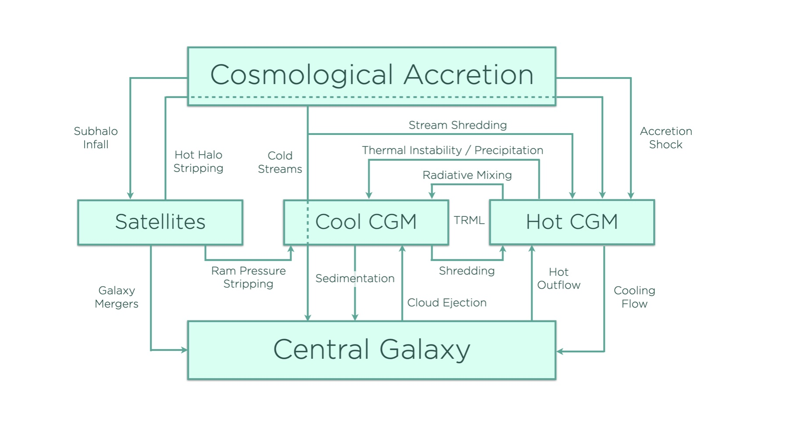

<head>
  <title>MathJax tests</title>
  
  
  
  
  
  
</head>

# Multiphase Gas
{: .no_toc}

The most basic **ExpCGM** models assume that a galactic atmosphere is homogeneous, with uniform pressure, gas density, and temperature at each radius. However, atmospheric gas with a radiative cooling time $t_{\rm cool}$ much shorter than the dissipation timescale $t_{\rm diss}$ of its non-thermal support energy is unlikely to remain homogeneous, as it is prone to thermal instability. 

High-density perturbations within such an atmosphere typically radiate energy more rapidly than low-density perturbations. Dissipation is not rapid enough to replenish those radiative losses. Differential cooling therefore enhances any density contrasts that arise, eventually producing gas clumps much denser than their surroundings, as long as thermal instability can progress to nonlinear amplitudes. (A future *Thermal Instability* page will provide more detail.) 

Astronomers often call gas with large density and temperature contrasts a *multiphase medium*. The properties of a multiphase galactic atmosphere significantly differ from those of a homogeneous atmosphere with the same total mass $M_{\rm CGM}$ and total energy $E_{\rm CGM}$. Those differences can alter both the gas supply to the central galaxy and the atmosphere's overall pattern of evolution. 

This page outlines how **ExpCGM** can be extended to include algorithms representing those important characteristics of a multiphase atmosphere.

  

    Contents
  

   {: .text-delta}
- TOC
{:toc}  

## Objectives

Multiphase gas algorithms for **ExpCGM** need to be modestly scoped, because detailed modeling of a multiphase medium requires computational methods far beyond the sophistication of the **ExpCGM** framework. Remember that the framework's primary objective is to represent the global structure of a galactic atmosphere so that its coupling with the central galaxy can be modeled. It tracks how cosmological accretion augments the atmosphere's total energy $E_{\rm CGM}$ and mass $M_{\rm CGM}$. It determines how radiative losses reduce $E_{\rm CGM}$ and allow some of the accreted gas to enter the central galaxy. It also accounts for the central galaxy's feedback response to its gas supply. (See the [Regulation](/ExpCGM/descriptions/Regulation) page for details.)

An **ExpCGM** algorithm for an evolving multiphase atmosphere should therefore focus on how the atmosphere's inhomogeneity affects $\dot{E}\_{\rm CGM}$ and $\dot{M}\_{\rm CGM}$. For example, atmospheric density contrasts can enhance radiative losses and boost the galaxy's gas supply. They can also alter how turbulent dissipation or shock fronts convert the atmosphere's kinetic energy into heat.

Different user-defined schemes for representing those effects can be tested within the **ExpCGM** framework, to see how they influence $\dot{E}\_{\rm CGM}$ and $\dot{M}\_{\rm CGM}$ and alter the atmosphere's thermalization fraction $f_{\rm th}$. Using **ExpCGM** to experiment with different multiphase gas models and to identify how the assumptions inherent in those models affect various observable properties of galactic atmospheres will hopefully yield useful constraints on the astrophysical processes determining those properties.

## Cool Gas Fraction

To represent multiphase gas, the **ExpCGM** framework defines an atmosphere's ***cool gas fraction*** $f_{\rm cool}$ to be the fraction of an atmosphere's gas mass that is "cool" compared to the atmosphere's gravitational temperature $T_\varphi$. The complementary "hot" gas fraction $1-f_{\rm cool}$ has a pressure
 $$P(r) = (1 - f_{\rm cool}) \frac {kT} {\mu m_p} \bar{\rho} (r)$$
where $\bar{\rho} (r)$ is the mean mass density at radius $r$ of an atmosphere in which cool gas occupies a negligible fraction of the volume. 

Applying the usual **ExpCGM** assumption of force balance then gives
  $$\frac {P} {f_{\rm th}} = \frac {\bar{\rho} f_\varphi v_{\rm c}^2} {\alpha_{\rm eff}}$$
for a multiphase atmosphere, implying that 
  $$f_{\rm th} = (1 - f_{\rm cool}) \left( \frac {\alpha_{\rm eff}} {2 f_\varphi} \right) \frac {T} {T_\varphi}$$
According to this last equation, an atmosphere's thermalization fraction $f_{\rm th}$ is similar to the fraction of the atmospheric gas mass that remains hot $(1 - f_{\rm cool})$, because the $\alpha_{\rm eff} / 2 f_\varphi$ factor is generally of order unity and the temperature $T$ of the hot phase is always similar to $T_\varphi$, because of how the hot phase is defined. 

Including multiphase gas within an **ExpCGM** atmosphere model therefore necessitates a reinterpretation of the $f_{\rm th}$ parameter. The force-balance condition for a multiphase atmosphere jointly supported by thermal and turbulent energy gives 
  $$\frac {kT} {\mu m_p} = \left( \frac {f_{\rm th}} {1 - f_{\rm cool}} \right) \frac {f_\varphi v_{\rm c}^2} {\alpha_{\rm eff}}$$
for the thermal support component and 
  $$f_{\rm cool}\sigma_{\rm 1D,cool}^2 + \left( 1 - f_{\rm cool} \right) \sigma_{\rm 1D,hot}^2 = \left( 1 - f_{\rm th} \right) \frac {f_\varphi v_{\rm c}^2} {\alpha_{\rm eff}}$$
for turbulent support from a cool component with velocity dispersion $\sigma_{\rm 1D, cool}$ and a hot component with velocity dispersion $\sigma_{\rm 1D, hot}$. A rise in $f_{\rm cool}$ can then compensate for a decline in $f_{\rm th}$ while the temperature $T$ of the hot component remains steady.

{: .note}
Separability of a multiphase atmosphere into distinct hot and cool components depends on the difference between a halo's gravitational temperature $T_\varphi$ and the equilbrium temperature $T_{\rm eq}$ of photoionized gas that is being heated by ultraviolet ionizing background radiation. If $T_\varphi \gg T_{\rm eq} \sim 10^4 ~{\rm K}$, then those two components are distinct, and the hot component fills most of the volume. However, dwarf galaxies in halos with gravitational temperatures less than $10^5 ~{\rm K}$ might not have distinct hot and cool components.

## Velocity Coupling

The presence of two velocity dispersions in the force balance constraint for a multiphase atmosphere raises an interesting question: How are those two velocity dispersions related? 

### Strong Coupling

If the motions of the cool component are strongly coupled to the motions of the hot component, meaning that $\sigma_{\rm 1D,hot} \approx \sigma_{\rm 1D,cool}$, then the force balance condition for a multiphase atmosphere becomes essentially identical to the one for a homogeneous atmosphere. The only conceptual difference is the interpretation of the $f_{\rm th}$ parameter, which is proportional to both $1-f_{\rm cool}$ and $T/T_\varphi$.

{: .note}
A multiphase atmosphere in which discrete cool clouds have column densities much smaller than the overall column density of the hot phase will be close to the strong coupling limit, because drag on a cold cloud moving through the hot medium then reduces its speed relative to the hot phase on a timescale that is short compared to the cloud's orbital timescale. To put it another way, the relative speed of a cool cloud with respect to the hot phase should be similar to its terminal velocity within the hot phase.

### Weak Coupling

The motions of cool clouds in an atmosphere jointly supported by turbulence and thermal pressure are essentially ballistic if hydrodynamical drag cannot couple them to the hot component on an orbital timescale. Each temperature component in an equilibrium **ExpCGM** atmosphere must then separately satisfy its own force balance condition. 

The force balance condition for the cool component becomes
  $$\sigma_{\rm 1D, cool}^2 = \left( \frac {2 f_\varphi} {\alpha_{\rm eff}} \right) \frac {v_{\rm c}^2} {2}$$
Force balance in the hot component independently implies a temperature
  $$T = \left( \frac {f_{\rm th}} {1 - f_{\rm cool}} \right) \left( \frac {2 f_\varphi} {\alpha_{\rm eff}} \right) T_\varphi$$
and a velocity dispersion
  $$\sigma_{\rm 1D, hot}^2 = \left( 1 - \frac {f_{\rm th}} {1 - f_{\rm cool}} \right) \left( \frac {2 f_\varphi} {\alpha_{\rm eff}} \right) \frac {v_{\rm c}^2} {2}$$
The ratio $f_{\rm th} / (1 - f_{\rm cool})$ determines the breakdown between thermal and turbulent support of the hot medium and needs to be of order unity to satisfy the stipulation $T \sim T_\varphi$.

{: .note}
The force balance condition given above for cool gas assumes an isotropic velocity dispersion, which might not be a good approximation for a population of ballistic clouds. 

### Sedimentation

Sedimentation occurs in between the strong-coupling and weak-coupling limits. A small amount of drag gradually drains orbital energy from clouds that would otherwise be ballistic, causing them to sink toward the center. That radial drift speed can be a model parameter, or it can be estimated based on a user-defined model for the properties of cool clouds. 

{: .note}
A future *Cloud Survival* page will discuss the conditions under which drifting clouds persist and the rate at which sedimentation supplies gas to a halo's central galaxy.

### Dissipation of Turbulent Support

Reduction of a multiphase atmosphere's turbulent support is easiest to model in the strong-coupling limit, because dissipation of turbulence in the hot medium then also reduces the velocity dispersion of the cool clouds. 

Dissipation of kinetic energy in the weak-coupling limit is more model dependent. One approach to modeling it is to estimate the rate of inelastic cloud-cloud collisions in a population of cool ballistic clouds. Some of the kinetic energy of two colliding clouds initially dissipates into heat, presumably in shock fronts. What happens next depends on how quickly such collisions turn heat into radiative energy: 

* Rapid cooling converts the majority of the dissipated kinetic energy into photons, contributing to $\dot{E}\_{\rm rad}$ and thereby reducing $E_{\rm CGM}$. 

* Slow cooling may transfer some of the heated gas from the atmosphere's cool component to the hot component, lowering $f_{\rm cool}$ while $f_{\rm th}$ increases.

The details of how to model the consequences of cloud-cloud collisions in a multiphase **ExpCGM** model atmosphere are currently left to the user.

## Mass Exchange

Conversion of hot gas to cool gas and back again can happen through many different channels in a multiphase galactic atmosphere. The figure below schematically represents many of those mass-exchange channels, but perhaps not all of them: 

<figure>
    
</figure>

An evolving **ExpCGM** atmospheric model cannot realistically represent all of these channels.  The key questions to consider when selecting the most important ones to represent are therefore: 

1. Which channels dominate the atmosphere's overall radiative energy loss rate $\dot{E}\_{\rm rad}$?
2. Which channels feed the most gas into the central galaxy, therefore determining $\dot{M}\_{\rm in}$ and the rate $\dot{E}\_{\rm fb}$ at which feedback adds energy to the atmosphere?

{: .note}
In the figure, TRML stands for *turbulent radiative mixing layers*, in which mixing of hot gas and cool gas produces gas at intermediate temperatures that can radiate energy much more rapidly than the unmixed hot and cool gas. Including the contribution of those mixing layers to $\dot{E}\_{\rm rad}$ requires an algorithm specifying how their contribution to the mean specific cooling rate $\langle \rho \Lambda_\rho \rangle$ depends on $f_{\rm cool}$, $\sigma_{\rm 1D,hot}$, $\sigma_{\rm 1D,cool}$, and $T$.

### Condensation

Consider first the timescale on which cooling converts hot gas into cool gas in an atmosphere with $t_{\rm cool} \ll f_{\rm th} t_{\rm diss}$. In a multiphase atmosphere with a mean mass density $\bar{\rho},$ the cooling time for *just the hot component* becomes
  $$t_{\rm cool} = \left( \frac {3 kT} {2 \mu m_p} \right) \frac {1} { (1 - f_{\rm cool}) \bar{\rho} \Lambda_\rho (T)}$$
Mass transfer from the hot phase to the cool phase while $\bar{\rho}$ remains constant therefore causes the hot-gas cooling time to rise and slows this particular channel for mass exchange, which asymptotically abates as $t_{\rm cool}$ approaches the universe's age.

{: .note}
The abatement of condensation in a multiphase galactic atmosphere was notably emphasized by Maller & Bullock (2004). It places an upper limit on the value of $f_{\rm cool}$ acheivable through condensation and ensures that at least some volume-filling hot gas remains in a condensing atmosphere.

In the **ExpCGM** framework, it is possible for mass exchange through the condensation channel to come into equilibrium *before* the atmosphere's cooling time exceeds the universe's age. That is because the atmosphere's overall thermal support fraction evolves according to 
  $$\frac {d f_{\rm th}} {dt} = \frac {1 - f_{\rm th}} {t_{\rm diss}} - \frac {(1 - f_{\rm th}) f_{\rm th}} {t_{\rm cool}} + \frac {(f_{\rm in,th} - f_{\rm th})} {t_{\rm in}}$$
(See the [Essentials](Essentials) page for a derivation of this equation and the definitions of its parameters). 

Cooling transfers gas from the hot phase to the cool phase until thermalization of the atmosphere's support energy reaches an equilibrium value at which $df_{\rm th}/dt = 0$:

  $$f_{\rm th} = \frac {t_{\rm cool}} {t_{\rm diss}}\left[ 1 +  \left( \frac {f_{\rm in,th} - f_{\rm th}}{1 - f_{\rm th}} \right)\frac {t_{\rm diss}} {t_{\rm in}} \right]$$

The thermal support fraction $f_{\rm th}$ consequently stabilizes on a timescale similar to the dissipation timescale $t_{\rm diss}$. The hot component in this equilibrium state radiates thermal energy at a rate that matches the total thermal energy input entering the atmosphere both directly, from sources of thermal energy, and indirectly, through dissipation of non-thermal energy input. 

### Turbulent Heating

How to model a multiphase atmosphere with $t_{\rm cool} \gg f_{\rm th} t_{\rm diss}$ is less clear. According to the thermalization equation, the atmosphere's thermal support fraction $f_{\rm th}$ should rise, because dissipation is generating thermal energy faster than radiative losses can shed it. If dissipation is indeed reducing $f_{\rm cool}$ in proportion to $1 - f_{\rm th}$, then the hot-gas mass fraction of a multiphase galactic atmosphere evolves on a timescale similar to $t_{\rm cool}$ toward the equilibrium value
  $$1 - f_{\rm cool}  = \left( \frac {2 f_\varphi} {\alpha_{\rm eff}} \frac {T_\varphi} {T} \right) \left[ 1 + \left( \frac {f_{\rm in,th} - f_{\rm th}} {1 - f_{\rm th}} \right)\frac {t_{\rm diss}} {t_{\rm in}} \right]\frac {t_{\rm cool}} {t_{\rm diss}}$$
Multiphase galactic atmospheres in the **ExpCGM** framework therefore converge toward a hot-gas mass fraction $\sim t_{\rm cool} / t_{\rm diss}$ when cooling is rapid with respect to dissipation.

However, dissipation that exceeds radiative cooling in a real galactic atmosphere does not necessarily transfer gas from the cool phase to the hot phase when $1 - f_{\rm cool}$ is less than $t_{\rm cool}/t_{\rm diss}$. Instead, dissipation of turbulence may expand the *volume* of the hot component without changing $f_{\rm cool}$. Wherever that circumstance arises, $f_{\rm cool}$ and $f_{\rm th}$ need to be treated separately, requiring an addtional differential equation for the evolution of $f_{\rm cool}$. 

One approach to representing such a situation is to define a thermal support fraction for just the hot gas:
  $$f_{\rm th, hot}  \equiv \frac {f_{\rm th}} { 1 - f_{\rm cool}} = \frac {kT} {kT + \mu m_p \sigma_{\rm 1D,hot}^2}$$
That definition then leads to the evolution equation

  $$\frac {d f_{\rm th, hot}} {dt} = \frac {\dot{f}_{\rm th} - f_{\rm th,hot} \dot{f}_{\rm cool}}{ 1 - f_{\rm cool}}$$

In this equation, the factor $\dot{f}\_{\rm cool}$ represents evolution of the cool gas mass fraction. To apply this approach, an **ExpCGM** user would need to specify a model for $f_{\rm cool}$ that evolves according to some combination of the processes schematically pictured in the complicated figure above. 

## Future Considerations

Given the complexity of the overall mass-exchange network, future development of the **ExpCGM** framework will need to focus on individual channels for changing $f_{\rm cool}$. In the meantime, it may be possible to explore whether the schematic thermalization model presented here is consistent with observations.

For example, in the limit $f_{\rm th} \ll 1$ the model predicts an equilibrium hot-gas fraction
  $$1 - f_{\rm cool} ~\approx~ \frac {\mu m_p \sigma_{\rm 1D}^2} {kT} \left( \frac {t_{\rm cool}}  {t_{\rm diss}} + f_{\rm th,in} \frac {t_{\rm cool}} {t_{\rm in}} \right)$$
In principle, the leading factor can be constrained with observations. If not, it should be of order unity in this limit, giving
  $$1 - f_{\rm cool} ~\sim~ \left( \frac {t_{\rm ff}} {t_{\rm diss}} \right) \frac {t_{\rm cool}}  {t_{\rm ff}} + f_{\rm th,in} \frac {t_{\rm cool}} {t_{\rm in}}$$
Here the ratio $t_{\rm cool} / t_{\rm diss}$ has been separated into a ratio relating the dissipation timescale to the local freefall timescale $t_{\rm ff}$ and a ratio relating the cooling timescale to $t_{\rm ff}$. For this purpose, **ExpCGM** defines the local freefall time to be $t_{\rm ff} \equiv (2 r / g)^{1/2} = 2^{1/2} (r/ v_{\rm c})$, where $g$ is the local gravitational acceleration.

When expressed like this, the first term in the estimate for $1 - f_{\rm cool}$ corresponds to what the hot-gas fraction would converge toward in the absence of energy input. The second term corrects the estimate to account for the fraction $f_{\rm th,in}$ of atmospheric energy input going directly into heat. In an atmosphere supported primarily by turbulence, the ratio $t_{\rm ff} / t_{\rm diss}$ will be similar to the ratio $r / \lambda_{\rm diss}$ relating $r$ to the driving scale $\lambda_{\rm diss}$ for the turbulence.

These estimates suggest an observational test: The scaling-relation predictions in the equations above can be checked to see if they are consistent with observational constraints on $f_{\rm cool}$, $\sigma_{\rm 1D} / v_{\rm c}$, and $t_{\rm cool}/t_{\rm ff}$. Large disagreements, especially a small hot-gas fraction in an atmosphere with both a long cooling time $(t_{\rm cool} / t_{\rm ff} \gg 1)$ and a large velocity dispersion $(\sigma_{\rm 1D} \sim v_{\rm c})$, would indicate either (1) that dissipation of kinetic energy does *not* transfer cool gas into the hot component, or (2) that $\lambda_{\rm diss}$ is much larger than $r$, meaning that the dissipation timescale for cold gas in a kinetically supported atmosphere is much longer than the atmosphere's dynamical timescale.
